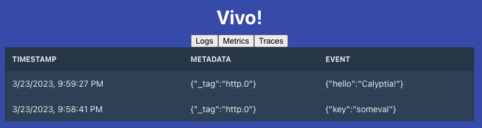

# Vivo (DEV)

This project is a new rewrite of [Vivo](https://github.com/calyptia/vivo) which provides a visualization interface for _logs_, _metrics,_ and _traces_.



## Disclaimers

1. I don't know Go or JS/React, but I made my best effort to put the basics of the infrastructure into the next chapter of the Vivo project. 
2. This won't work until https://github.com/fluent/fluent-bit/actions/runs/4507500973/jobs/7935338120 finish and publish the latest multi-arch Fluent Bit container image.

#### VALIDATE Fluent Bit Version

Make sure the Fluent Bit running inside `service` is at least the version `NIGHTLY_BUILD=2023-03-24-06_04_21`

## Why a rewrite ?

Sorry, I cannot sleep well knowing that a simple UI viewer for Telemetry data needs more than 500MB in space between container images; we can do it better; let's keep it under 80MB (NOTE: the Dockerfile for the final image is based on debian bullseye, it's an improvement but it's not there yet, I don't have enough time to move it to distroless or similar)

Also, this is not a full rewrite, I need help so others can step up and bring the missing functionality and styles to this new version.

The previous version worked fine for logs, but now we support metrics and traces in addition to logs, so we needed to extend the project scope. The previous version used to depend on Fluent Bit stdout to trap records output which is complex to extend for different types of telemetry data.

This version uses a different approach and components:

- [component] [service/](./service): Golang service that starts/manages Fluent Bit
- [component] [frontend/](./frontend): Frontend React App that pulls telemetry data from Fluent Bit (new approach)
- [component] Fluent Bit: telemetry agent with new export/streaming capabilities

To simplify the data management per type, Fluent Bit now supports a new output plugin called [Vivo Exporter](https://docs.fluentbit.io/manual/v/dev-2.1/pipeline/outputs/vivo-exporter) which buffers every telemetry data in a queue of a fixed size and exposes the content through HTTP endpoints: /logs, /metrics, /traces. The UI part pulls data from there.

All the data retrieved from the Fluent Bit Vivo Exporter comes in JSON format, and each event type has its specific structure.

## Running this version of Vivo

Make sure you have Docker in your environment, then inside this repository, start the services with docker-compose:

```
docker-compose up
```

You can access the Web interface by using the following address:

- [http://127.0.0.1:8000](http://127.0.0.1:8000)

After a successful start, the following end-points will be available:

| Port | Interface | Description |
| --- | --- | --- |
| 8000 | Web UI | The web interface for Vivo |
| 9000 | Forward Input | Data ingestion by using Fluent Forward protocol |
| 9010 | HTTP Input | Data ingestion through HTTP |
| 2025 | Vivo Exporter | Fluent Bit Vivo streams where the UI pulls data from. This is always exposed. |

### Ingesting sample data

Let's use `curl`:

```
curl -XPOST -H "Content-Type: application/json" -d '{"hello": "Calyptia!"}' http://127.0.0.1:9010
```

## Known Issues or fixes needed

- When ingesting 1 record with Curl, the UI is not rendering the content, but when sending a second record it gets rendered properly. This is a bug in the UI code.
- [Vivo Exporter](https://docs.fluentbit.io/manual/v/dev-2.1/pipeline/outputs/vivo-exporter#streams-and-ids) support ranges which are [explained here](https://docs.fluentbit.io/manual/v/dev-2.1/pipeline/outputs/vivo-exporter#streams-and-ids) in the documentation. For some reason the HTTP requests done by the UI are not appending the query string parameters.
- The UI tabs for metrics and traces should print just raw JSON. Note that for logs there is a expected schema where the UI use that to render the content. If metrics and traces are received, the rendering will fail due to the unexpected schema.
- UI parity level with original Vivo UI version.